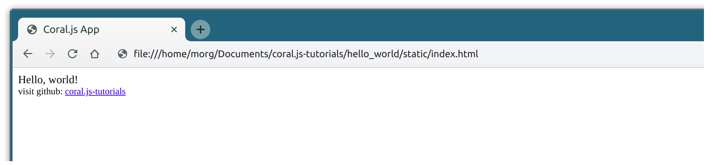
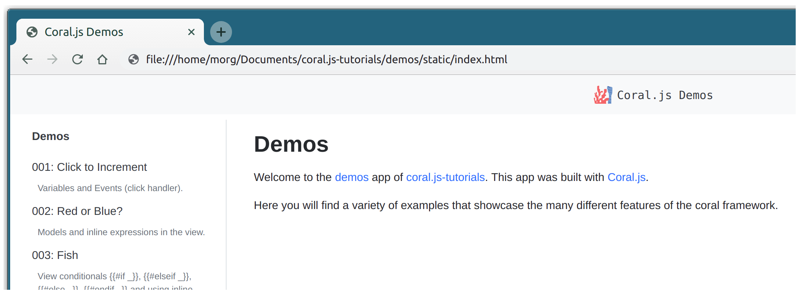

# Overview of coral.js-tutorials
**This repo contains demos for [Coral.js](https://github.com/lockerdome/coral.js), an extensible, functional-reactive framework.**

Coral.js is an open source project of [LockerDome](https://lockerdome.com).

### [Visit our live demo app here.](https://lockerdome.github.io/coral.js-tutorials/demos/static/)

###  Table of Contents
* [List of Demos](#list_of_demos)
* [How To Use This Repo](#how_to_use_this_repo)
* [Contributing](#contributing)
* [License](#license)

#  List of Demos
* **hello_world** gets you started with a barebones Coral.js app ([code](https://github.com/lockerdome/coral.js-tutorials/tree/master/hello_world)).
* **demos** is full of examples showcasing different features of Coral.js ([code](https://github.com/lockerdome/coral.js-tutorials/tree/master/demos) | [live](https://lockerdome.github.io/coral.js-tutorials/demos/static/)).

#  How To Use This Repo

## Steps
1. [Setup and Installation](#setup_and_installation)
2. [Build an app](#build_an_app)
3. [View an app](#view_an_app)

## 1.  Setup and Installation

#### Prerequisites and Compatibility:
* The Coral.js compiler supports versions of Node.js 0.8 and above.

## 2.  Build an app

1. Inside coral.js-tutorials, navigate to the [demo directory of your choice](#list_of_demos). The example below uses hello_world:

  `$ cd hello_world`

  `$ npm install`

2. Then, run either of the following commands in your terminal to build your _Hello, world!_ app:

  `$ ./build.sh` (this runs the same code as below)

  \- OR -

  `$ node node_modules/@lockerdome/coral.js/cli/cli.js --s compiler_settings.js`

## 3.  View an app

E.g. with `hello_world`, visit

/../your/path_to/`coral.js-tutorials/hello_world/static/index.html`

E.g. with `demos`, visit:

/../your/path_to/`coral.js-tutorials/demos/static/index.html`

#  Contributing

Coral.js is an open source project and we gladly welcome contributions.

Before submitting a pull request, you'll need to make sure you [sign the CLA](https://lockerdome.com/cla).

Please read [our guide](https://github.com/lockerdome/coral.js-tutorials/tree/master/CONTRIBUTING.md) on contributing for additional information.

#  License

Coral.js is [MIT licensed](https://github.com/lockerdome/coral.js-tutorials/tree/master/LICENSE).
